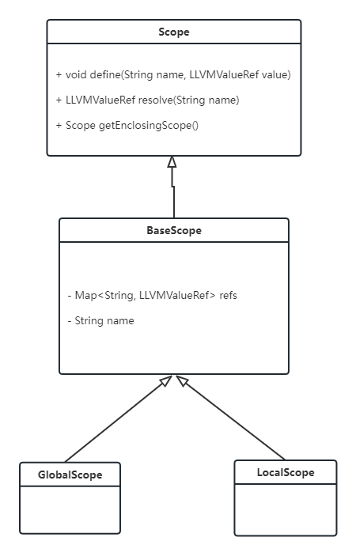

# Lab5 FunctionCall & Var 实验报告

## 实验目标

完成函数定义，函数调用，局部变量的定义和使用的翻译。

## 设计思路

我使用 visitor 模式，通过对语法分析树进行遍历来进行中间代码的生成。

现在需要考虑覆盖哪些 visit 方法.

由于要翻译函数定义和调用，因此需要覆盖:

- visitFuncDef
- visitFuncCallExp
- visitBlock
- visitReturnStmt

由于需要翻译局部变量的定义和使用，因此需要覆盖:

- visitLVal
- visitVarDecl
- visitConstDecl
- visitAssignStmt

以及之前已经实现的对于表达式的翻译。

变量定义，函数定义以及变量使用涉及符号的定义和使用，因此需要使用符号表。原来的符号表和类型系统是用于类型检擦，和本次实验的兼容性不好，因此需要修改设计。

## 实现中遇到的困难以及解决

主要是关于数组部分的翻译，和函数定义中无返回值的函数没有显式的 return 语句的问题。

对于数组部分的翻译，由于网上关于 LLVMBuildGEP 的说明比较缺乏，我不是很了解 LLVMBuildGEP 的用法，因此最后只根据网上的例子，按照数组都是一维的假设来处理。

对于没有显式的 return 语句这个问题，我采用一个变量 hasReturn，在 进入函数定义的 block 之前将这个变量设为 false，在 visitReturnStmt 中将其置为 true，如果在 visitFuncDef 中调用 visitBlock 返回之后 hasReturn 仍然为 false，则说明没有显式的 return 语句，需要我自己手动加上 LLVMBuildRetVoid。